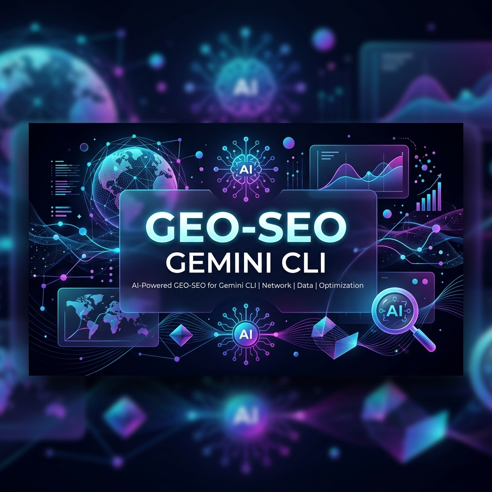

<p align="center">
  
</p>

> [!NOTE]
> This repository is forked and built upon the popular tool [geo-seo-claude](https://github.com/zubair-trabzada/geo-seo-claude) but is customized specifically for Gemini CLI users.

<p align="center">
  <strong>GEO-first, SEO-supported.</strong> Optimize websites for Gemini CLI while maintaining traditional SEO foundations.
</p>

<p align="center">
  AI search is eating traditional search. This tool optimizes for where traffic is going, not where it was.
</p>

---

## Why GEO Matters (2026)

| Metric | Value |
|--------|-------|
| GEO services market | $850M+ (projected $7.3B by 2031) |
| AI-referred traffic growth | +527% year-over-year |
| AI traffic conversion rate vs organic | 4.4x higher |
| Gartner: search traffic drop by 2028 | -50% |
| Brand mentions vs backlinks for AI | 3x stronger correlation |
| Marketers investing in GEO | Only 23% |

---

## Quick Start

### Installation (macOS/Linux)

1.  **Clone the repository:**
    ```bash
    git clone https://github.com/msampathkumar/geo-seo-for-geminicli.git
    cd geo-seo-for-geminicli
    ```
2.  **Install dependencies:**
    ```bash
    ./install.sh
    ```
    *(This script installs Python dependencies and potentially other requirements needed for the scripts and agents.)*

### Gemini CLI Integration

Once dependencies are installed via `./install.sh`, you can interact with the GEO SEO features via the Gemini CLI. The project's primary skill, `geo/SKILL.md`, is designed to be discoverable and executable by the Gemini CLI. Commands are invoked using the `/geo` prefix. The `install.sh` script has been updated to check for and guide the installation of the Gemini CLI.

### Requirements

- Python 3.8+
- Gemini CLI installed and configured (install using `npm install -g @google/gemini-cli`)
- Git
- Optional: Playwright (for advanced browser automation, if not handled by Gemini CLI itself)

---

## Gemini CLI Commands

Use these commands within your Gemini CLI session:

| Command | What It Does |
|---------|-------------|
| `/geo audit <url>` | Full GEO + SEO audit with parallel subagents |
| `/geo quick <url>` | 60-second GEO visibility snapshot |
| `/geo citability <url>` | Score content for AI citation readiness |
| `/geo crawlers <url>` | Check AI crawler access (robots.txt) |
| `/geo llmstxt <url>` | Analyze or generate llms.txt |
| `/geo brands <url>` | Scan brand mentions across AI-cited platforms |
| `/geo platforms <url>` | Platform-specific optimization |
| `/geo schema <url>` | Structured data analysis & generation |
| `/geo technical <url>` | Technical SEO audit |
| `/geo content <url>` | Content quality & E-E-A-T assessment |
| `/geo report <url>` | Generate client-ready GEO report |
| `/geo report-pdf` | Generate professional PDF report with charts & visualizations |

---

## Project Structure & Architecture

This project is structured to be modular and extensible, with distinct components managed by Gemini CLI skills and agents.

```
geo-seo-claude/
├── geo/                          # Main skill orchestrator for Gemini CLI
│   └── SKILL.md                  # Entry point for Gemini CLI commands (e.g., /geo)
├── skills/                       # Specialized sub-skills, each performing a specific GEO SEO task.
│   ├── geo-audit/                # Orchestrates full audit, integrates agents, and scores results.
│   ├── geo-citability/           # Focuses on AI citation readiness scoring.
│   ├── geo-crawlers/             # Analyzes AI crawler access and robots.txt directives.
│   ├── geo-llmstxt/              # Handles analysis and generation of the llms.txt standard file.
│   ├── geo-brand-mentions/       # Scans for brand presence on AI-cited platforms.
│   ├── geo-platform-optimizer/   # Optimizes for specific AI search platforms.
│   ├── geo-schema/               # Manages structured data (JSON-LD) for AI discoverability.
│   ├── geo-technical/            # Assesses technical SEO foundations.
│   ├── geo-content/              # Evaluates content quality and E-E-A-T signals.
│   ├── geo-report/               # Generates client-ready markdown reports.
│   └── geo-report-pdf/           # Creates professional PDF reports with visualizations.
├── agents/                       # Core analysis agents that perform complex computations or data fetching.
│   ├── geo-ai-visibility.md      # Combines audits, citability, crawlers, and brand mentions.
│   ├── geo-platform-analysis.md  # Analyzes readiness for specific AI platforms.
│   ├── geo-technical.md          # Performs deep technical SEO analysis.
│   ├── geo-content.md            # Assesses content quality and E-E-A-T signals.
│   └── geo-schema.md             # Analyzes and validates schema markup.
├── scripts/                      # Utility scripts for data fetching, processing, and report generation.
│   ├── fetch_page.py             # Fetches and parses web page content.
│   ├── citability_scorer.py      # The engine for AI citability scoring.
│   ├── brand_scanner.py          # Detects and analyzes brand mentions.
│   ├── llmstxt_generator.py      # Validates and generates llms.txt files.
│   └── generate_pdf_report.py    # Uses ReportLab to generate PDF reports.
├── schema/                       # JSON-LD templates for structured data to enhance AI discoverability.
│   ├── organization.json         # Organization schema (with sameAs).
│   ├── local-business.json       # LocalBusiness schema.
│   ├── article-author.json       # Article + Person schema (for E-E-A-T).
│   ├── software-saas.json        # SoftwareApplication schema.
│   ├── product-ecommerce.json    # Product schema with offers.
│   └── website-searchaction.json # WebSite + SearchAction schema.
├── install.sh                    # Script to install project dependencies (Python, etc.).
├── uninstall.sh                  # Script to uninstall project components.
├── requirements.txt              # Lists Python dependencies.
└── README.md                     # This file.
```

---

## How It Works

### Full Audit Flow (via Gemini CLI)

When you execute a command like `/geo audit https://example.com` within the Gemini CLI:

1.  **Orchestration:** The `geo/SKILL.md` file, recognized by the Gemini CLI, routes the command to the appropriate sub-skill (e.g., `geo-audit`).
2.  **Discovery & Initialization:** The `geo-audit` skill or its associated agents initiate by fetching the target URL, detecting business types, and crawling sitemaps using utilities from the `scripts/` directory.
3.  **Parallel Analysis:** The Gemini CLI environment efficiently launches the core analysis agents (`agents/` directory) in parallel. These agents leverage specialized sub-skills (`skills/`) and utility scripts for tasks such as:
    *   **AI Visibility:** Assessing citability, crawler access, and brand mentions.
    *   **Platform Analysis:** Evaluating readiness for Gemini CLI.
    *   **Technical SEO:** Checking Core Web Vitals, SSR, security, and mobile-friendliness.
    *   **Content Quality:** Evaluating E-E-A-T, readability, and freshness.
    *   **Schema Markup:** Detecting, validating, and potentially generating JSON-LD from `schema/` templates.
4.  **Synthesis & Scoring:** All collected data and scores are aggregated. A composite GEO Score (0-100) is calculated based on weighted categories.
5.  **Reporting:** The final output is presented, often with an option to generate detailed reports (markdown or PDF) using `scripts/generate_pdf_report.py`, providing prioritized action plans.

### Scoring Methodology

| Category | Weight |
|----------|--------|
| AI Citability & Visibility | 25% |
| Brand Authority Signals | 20% |
| Content Quality & E-E-A-T | 20% |
| Technical Foundations | 15% |
| Structured Data | 10% |
| Platform Optimization | 10% |

---

## Key Features

### Citability Scoring
Analyzes content blocks for AI citation readiness. Optimal AI-cited passages are 134-167 words, self-contained, fact-rich, and directly answer questions.

### AI Crawler Analysis
Checks robots.txt for AI crawlers (including GeminiBot) and provides specific allow/block recommendations.

### Brand Mention Scanning
Brand mentions correlate 3x more strongly with AI visibility than backlinks. Scans YouTube, Reddit, Wikipedia, LinkedIn, and 7+ other platforms.

### Platform-Specific Optimization
Only 11% of domains are cited by both Gemini and Google AI Overviews for the same query. Provides tailored recommendations per platform.

### llms.txt Generation
Generates the emerging llms.txt standard file that helps AI crawlers understand your site structure.

### Client-Ready Reports
Generates professional GEO reports in markdown or PDF format. PDF reports include score gauges, bar charts, platform readiness visualizations, color-coded tables, and prioritized action plans — ready to deliver to clients.

---

## Use Cases

-   **GEO Agencies** — Run client audits and generate deliverables.
-   **Marketing Teams** — Monitor and improve AI search visibility.
-   **Content Creators** — Optimize content for AI citations.
-   **Local Businesses** — Get found by AI assistants.
-   **SaaS Companies** — Improve entity recognition across AI platforms.
-   **E-commerce** — Optimize product pages for AI shopping recommendations.

---

## Uninstall

To remove the project's components (Python dependencies, scripts, etc.):

```bash
./uninstall.sh
```

Or manually:
```bash
# Remove installed Python packages (if installed in a virtual environment)
# pip uninstall -r requirements.txt

# Remove project scripts and data (adjust path if skill was installed globally)
rm -rf ~/.gemini/skills/geo ~/.gemini/skills/geo-* # Example: may vary based on Gemini CLI installation method
# If installed locally and linked, this might be project-specific removal.
```

---

## Want to Turn This Into a Business?

The tool is free. Learning how to monetize it is where the community comes in.

**[Join the AI Workshop Community →](https://skool.com/aiworkshop)**

Inside you'll get:
-   **Video walkthroughs** — Step-by-step setup, running audits, reading results.
-   **Client acquisition playbook** — How to find prospects, pitch GEO services, and close deals.
-   **Live office hours** — Bring your audit results, get direct help.
-   **GEO agency pricing & templates** — Proposal docs, cold outreach scripts, onboarding workflows.

GEO agencies charge $2K–$12K/month. This tool does the audit. The community teaches you how to sell it.

---

## License

MIT License

---

## Contributing

Contributions welcome!

---

Built for the AI search era.